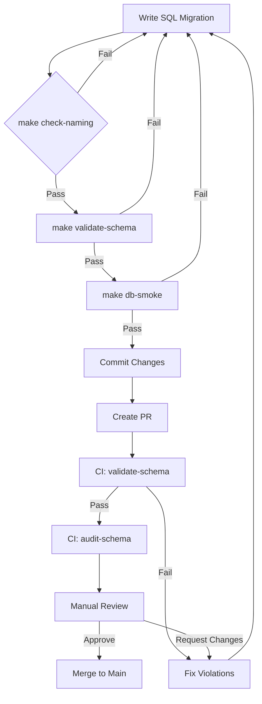

# Canonical Schema Enforcement System

**Purpose**: Comprehensive enforcement system ensuring zero schema drift and 100% canonical compliance.

**Version**: 1.0.0
**Status**: Production-Ready
**Last Updated**: 2025-12-09

---

## Overview

The Canonical Schema Enforcement System provides automated validation, auditing, and quality gates to maintain database schema integrity across the entire development lifecycle.

### What Problem Does This Solve?

**Without Enforcement:**
- ❌ Schema drift across branches
- ❌ Inconsistent naming conventions
- ❌ Missing RLS policies (security risk)
- ❌ Broken relationships and foreign keys
- ❌ Undocumented schema changes

**With Enforcement:**
- ✅ Single source of truth (`DATA_MODEL.md` + canonical SQL)
- ✅ Automated validation in CI/CD
- ✅ Pre-commit and PR-level checks
- ✅ AI-powered schema auditing
- ✅ Zero schema drift guarantee

---

## System Components

### 1. Canonical Schema Specification

**Source of Truth:**
- **Design Specification**: `docs/DATA_MODEL.md` (human-readable spec)
- **Implementation**: `packages/db/sql/*.sql` (executable SQL)

**What It Defines:**
```yaml
Naming Conventions:
  - All identifiers: snake_case only
  - Tables: tenants, workspaces, agent_runs
  - Columns: user_id, created_at, tenant_id
  - Functions: set_tenant_context, graph_search

Canonical Types:
  - IDs: uuid PRIMARY KEY DEFAULT gen_random_uuid()
  - Timestamps: timestamptz DEFAULT now()
  - Embeddings: vector(1536) with model text
  - Metadata: jsonb DEFAULT '{}'::jsonb

Entity Graph:
  - tenants (1) → (*) workspaces → (*) agents → (*) agent_runs
  - agents (*) ←→ (*) skills (via agent_skills)
  - RAG flow: sources → documents → chunks → embeddings
  - KG flow: kg.nodes ←─ kg.edges ─→ kg.nodes

Multi-Tenant Access:
  - All tables: tenant_id uuid NOT NULL
  - Workspace-scoped: workspace_id uuid
  - RLS: current_setting('app.current_tenant_id')
  - Context function: set_tenant_context(tenant_uuid, workspace_uuid)
```

**Reference**: [Data Model Specification](DATA_MODEL.md)

---

### 2. Developer Checklist

**File**: `docs/CANONICAL_SCHEMA_CHECKLIST.md`

**Purpose**: Pre-merge checklist for manual code review

**Key Sections:**
1. Location & Source of Truth verification
2. Naming & Type compliance check
3. Multi-Tenancy & RLS validation
4. Relationship integrity verification
5. RAG & KG-specific rules
6. Indexing & Performance requirements
7. Validation & Testing commands

**Usage:**
```bash
# Before submitting PR
cat docs/CANONICAL_SCHEMA_CHECKLIST.md

# Validate manually
make check-naming
make validate-schema
make check-rls
make db-smoke
```

**Reference**: [Canonical Schema Checklist](CANONICAL_SCHEMA_CHECKLIST.md)

---

### 3. AI-Powered Schema Auditor

**File**: `docs/CANONICAL_SCHEMA_AUDITOR_PROMPT.md`

**Purpose**: Automated schema validation agent for reviewing migrations

**Capabilities:**
- Detects naming convention violations
- Identifies type mismatches
- Verifies multi-tenant controls
- Checks relationship integrity
- Flags shadow tables
- Validates KG-specific rules
- Generates complete fix patches

**Input:** Proposed SQL migration(s) + optional `DATA_MODEL.md` diff

**Output:**
```markdown
# CANONICAL SCHEMA AUDIT REPORT

## SUMMARY
Status: APPROVE / REJECT / WARN

## VIOLATIONS (if any)
- Violation 1: [exact issue + fix]
- Violation 2: [exact issue + fix]

## PATCHED SQL
-- Complete corrected migration

## DECISION
Action Required: [specific fixes]
```

**Usage:**
```bash
# Audit single file
claude --system-prompt "$(cat docs/CANONICAL_SCHEMA_AUDITOR_PROMPT.md)" \
       --file packages/db/sql/06_new_migration.sql \
       "Audit this SQL migration for canonical schema compliance"

# Audit all changed files
make audit-schema
```

**Reference**: [Canonical Schema Auditor Prompt](CANONICAL_SCHEMA_AUDITOR_PROMPT.md)

---

### 4. Makefile Validation Targets

**File**: `Makefile`

**Targets Added:**

#### Core Validation
```makefile
validate-schema      # 6-step schema integrity check
db-smoke            # Comprehensive smoke tests (all entities)
check-naming        # Scan for camelCase/PascalCase violations
check-rls           # RLS policy coverage report
validate-all        # Run all validation checks
```

#### AI Auditing (requires Claude CLI)
```makefile
audit-schema        # AI-powered schema compliance audit
```

#### Quick Commands
```bash
# Validate entire schema
make validate-all

# Check specific area
make check-naming
make check-rls

# Run smoke tests
make db-smoke

# AI audit (requires claude CLI)
make audit-schema
```

**Validation Steps (`validate-schema`):**
1. Database connectivity check
2. Canonical tables existence check
3. KG schema completeness check
4. RLS policy verification
5. Index verification
6. pgvector extension check

**Smoke Tests (`db-smoke`):**
1. Core entities row counts
2. RAG entities row counts
3. Knowledge graph statistics
4. Node type distribution (top 10)
5. Edge type distribution (top 10)

---

### 5. CI/CD Integration

**File**: `.github/workflows/schema-validation.yml`

**Jobs:**

#### Job 1: `validate-schema`
```yaml
Purpose: Full schema validation with PostgreSQL service
Steps:
  1. Setup PostgreSQL 15 with pgvector
  2. Run naming convention checks
  3. Initialize database (init + seed)
  4. Validate schema integrity
  5. Check RLS coverage
  6. Run smoke tests
  7. Generate schema report
```

#### Job 2: `audit-schema`
```yaml
Purpose: Detect and report schema changes
Triggers: Pull requests only
Steps:
  1. Detect changed SQL files
  2. Generate compliance checklist
  3. Comment on PR with requirements
  4. Add to PR summary
```

#### Job 3: `block-if-violations`
```yaml
Purpose: Block merge if validation fails
Triggers: When validate-schema fails
Action: Fail workflow with error message
```

**Workflow Triggers:**
- Pull requests affecting `packages/db/sql/**` or `docs/DATA_MODEL.md`
- Push to main branch affecting `packages/db/sql/**`

**Protection:**
- ❌ Cannot merge if naming checks fail
- ❌ Cannot merge if schema validation fails
- ❌ Cannot merge if RLS checks fail
- ❌ Cannot merge if smoke tests fail

---

### 6. Pull Request Template

**File**: `.github/pull_request_template.md`

**Features:**
- Comprehensive DB schema change section
- Complete canonical schema checklist
- Migration safety checklist
- Validation command prompts
- Documentation requirements
- Pre-merge sign-off

**Key Sections:**
1. Schema Change Summary
2. Canonical Schema Compliance Checklist (35 items)
3. Migration Safety verification
4. Validation Commands output
5. Documentation updates

---

## Enforcement Levels

### Level 1: Pre-Commit (Local)

**Tools:**
- Git pre-commit hook (optional)
- `make check-naming` - Fast naming scan
- Manual checklist review

**Enforcement:** Recommended but not blocking

**Setup:**
```bash
# Install pre-commit hook
cat > .git/hooks/pre-commit <<'EOF'
#!/bin/bash
SQL_FILES=$(git diff --cached --name-only | grep "packages/db/sql/")
if [ -n "$SQL_FILES" ]; then
  echo "Running schema validation..."
  make check-naming || exit 1
fi
EOF
chmod +x .git/hooks/pre-commit
```

---

### Level 2: Pull Request (CI)

**Tools:**
- GitHub Actions workflow
- Automated schema validation
- AI auditing (if Claude CLI configured)
- PR comments with checklist

**Enforcement:** Blocking (cannot merge if fails)

**Checks:**
- ✅ Naming conventions (camelCase detection)
- ✅ Schema integrity (all tables exist)
- ✅ RLS coverage (policies present)
- ✅ Smoke tests (data validation)
- ✅ PostgreSQL service integration

---

### Level 3: Manual Review (Human)

**Tools:**
- PR template checklist
- Canonical schema checklist
- Manual RLS testing
- Documentation review

**Enforcement:** Required sign-off

**Reviewer Checklist:**
1. PR template fully completed
2. All canonical schema items checked
3. `DATA_MODEL.md` updated
4. Migration file naming correct
5. RLS manually tested
6. Smoke test output reviewed

---

### Level 4: AI Auditing (Optional)

**Tools:**
- Claude AI with auditor prompt
- Full migration analysis
- Complete fix generation

**Enforcement:** Optional but recommended

**Usage:**
```bash
# Run AI audit on changed files
make audit-schema

# Or manually for detailed report
claude --system-prompt "$(cat docs/CANONICAL_SCHEMA_AUDITOR_PROMPT.md)" \
       --file packages/db/sql/06_new_migration.sql \
       "Full audit report with all details"
```

---

## Workflow Integration

### Development Workflow



### CI/CD Pipeline

```yaml
PR Opened/Updated:
  1. detect_changed_sql_files
  2. run_naming_checks (BLOCKING)
  3. spin_up_postgres_service
  4. run_schema_validation (BLOCKING)
  5. run_rls_checks (BLOCKING)
  6. run_smoke_tests (BLOCKING)
  7. generate_schema_report
  8. comment_on_pr_with_checklist
  9. PASS → allow merge
  10. FAIL → block merge

Push to Main:
  1. run_full_validation_suite
  2. generate_deployment_report
  3. update_schema_documentation
```

---

## Quality Gates

### Gate 1: Naming Conventions
```bash
make check-naming
```
**Blocks:** camelCase, PascalCase, `timestamp` without `tz`

**Pass Criteria:**
- ✅ Zero naming violations detected
- ✅ All timestamps use `timestamptz`
- ✅ All identifiers are `snake_case`

---

### Gate 2: Schema Integrity
```bash
make validate-schema
```
**Blocks:** Missing tables, incomplete KG schema, missing pgvector

**Pass Criteria:**
- ✅ Database connection successful
- ✅ All canonical tables exist
- ✅ KG schema complete (nodes, edges, ingestion_log, schema_version)
- ✅ RLS policies enabled
- ✅ Indexes created
- ✅ pgvector extension loaded

---

### Gate 3: RLS Coverage
```bash
make check-rls
```
**Blocks:** Missing RLS policies on tenant-scoped tables

**Pass Criteria:**
- ✅ All tables in `public` schema have RLS
- ✅ All tables in `kg` schema have RLS (if applicable)
- ✅ RLS policies use `current_setting('app.current_tenant_id')`

---

### Gate 4: Smoke Tests
```bash
make db-smoke
```
**Blocks:** Missing data, broken relationships, zero counts

**Pass Criteria:**
- ✅ All tables queryable
- ✅ Knowledge graph has nodes and edges
- ✅ Node/edge types match canonical ontology
- ✅ No broken foreign keys

---

### Gate 5: AI Audit (Optional)
```bash
make audit-schema
```
**Blocks:** REJECT status from AI auditor

**Pass Criteria:**
- ✅ All SQL files return APPROVE or WARN
- ✅ No REJECT responses
- ✅ All violations fixed

---

## Common Scenarios

### Scenario 1: Adding a New Table

**Required Steps:**

1. **Update DATA_MODEL.md**
```markdown
#### new_table_name

**Purpose**: [description]

**Columns**:
- `id` (uuid, PK)
- `tenant_id` (uuid, NOT NULL)
- `workspace_id` (uuid)
- `column_name` (type)
- `created_at` (timestamptz)

**Relationships**:
- FK to parent_table(id)

**RLS Policy**: Tenant isolation via tenant_id and workspace_id
```

2. **Create Migration File**
```sql
-- packages/db/sql/06_new_table.sql
CREATE TABLE new_table_name (
  id uuid PRIMARY KEY DEFAULT gen_random_uuid(),
  tenant_id uuid NOT NULL,
  workspace_id uuid NOT NULL,
  column_name type,
  created_at timestamptz DEFAULT now()
);

-- RLS
ALTER TABLE new_table_name ENABLE ROW LEVEL SECURITY;

CREATE POLICY tenant_isolation ON new_table_name
  USING (
    tenant_id = current_setting('app.current_tenant_id', true)::uuid
    AND workspace_id = current_setting('app.current_workspace_id', true)::uuid
  );

-- Indexes
CREATE INDEX idx_new_table_tenant_workspace ON new_table_name(tenant_id, workspace_id);
```

3. **Validate Locally**
```bash
make check-naming
make db-init       # Apply migration
make validate-schema
make check-rls
make db-smoke
```

4. **Create PR**
- Complete canonical schema checklist in PR template
- Attach validation command outputs
- Update `DATA_MODEL.md` in same PR

5. **CI Validates**
- GitHub Actions runs full validation suite
- PR comment added with checklist
- Merge blocked if any check fails

6. **Manual Review**
- Reviewer verifies checklist completion
- Reviewer manually tests RLS
- Reviewer approves PR

7. **Merge**
- All checks pass
- PR merged to main
- Schema deployed to staging/production

---

### Scenario 2: Modifying Existing Column

**Required Steps:**

1. **Check Impact**
```bash
# Find all references
grep -r "old_column_name" packages/
```

2. **Update DATA_MODEL.md**
```markdown
- `old_column_name` → `new_column_name` (renamed for clarity)
```

3. **Create Migration**
```sql
-- packages/db/sql/07_rename_column.sql
ALTER TABLE table_name RENAME COLUMN old_column_name TO new_column_name;
```

4. **Update Application Code**
```typescript
// Update all TypeScript references
// Update all SQL queries
// Update all tests
```

5. **Validate**
```bash
make check-naming
make validate-schema
npm test
```

6. **Create PR** (same process as Scenario 1)

---

### Scenario 3: Fixing Schema Violation

**Detection:**
```bash
make check-naming
# Output: ❌ Found camelCase in packages/db/sql/05_rag_entities.sql
```

**Fix:**
```sql
-- Before (violation)
CREATE TABLE ragDocuments (
  docId uuid PRIMARY KEY,
  createdAt timestamp
);

-- After (compliant)
CREATE TABLE rag_documents (
  doc_id uuid PRIMARY KEY DEFAULT gen_random_uuid(),
  created_at timestamptz DEFAULT now()
);
```

**Validation:**
```bash
make check-naming  # Should pass now
make validate-schema
```

---

## Troubleshooting

### Issue 1: "Database connection failed"
```bash
# Check POSTGRES_URL is set
echo $POSTGRES_URL

# Test connection manually
psql "$POSTGRES_URL" -c "SELECT version();"

# If local dev, ensure Supabase running
supabase status
```

---

### Issue 2: "KG schema incomplete"
```bash
# Check what's missing
psql "$POSTGRES_URL" -c "\dt kg.*"

# Reinitialize if needed
make db-reset
make db-all
```

---

### Issue 3: "RLS policies missing"
```bash
# Find tables without RLS
make check-rls

# Add RLS policy
psql "$POSTGRES_URL" -c "
ALTER TABLE table_name ENABLE ROW LEVEL SECURITY;

CREATE POLICY tenant_isolation ON table_name
  USING (tenant_id = current_setting('app.current_tenant_id', true)::uuid);
"
```

---

### Issue 4: "Claude CLI not found" (for AI audit)
```bash
# Install Claude CLI
npm install -g @anthropic-ai/claude-cli

# Configure API key
claude config set apiKey YOUR_ANTHROPIC_API_KEY

# Test
claude "Hello, test message"
```

---

## Maintenance

### Weekly Tasks
- [ ] Review CI failure reports
- [ ] Update canonical schema documentation
- [ ] Review new edge cases in auditor prompt

### Monthly Tasks
- [ ] Audit all SQL files with AI auditor
- [ ] Review and update quality gate thresholds
- [ ] Update PR template based on common mistakes

### Quarterly Tasks
- [ ] Review canonical types for new patterns
- [ ] Update RLS policy templates
- [ ] Refresh schema validation logic

---

## Metrics & KPIs

### Success Metrics
- **Schema Drift**: 0 violations detected in production
- **RLS Coverage**: 100% of tenant-scoped tables
- **Naming Compliance**: 100% `snake_case` adherence
- **CI Pass Rate**: ≥95% first-pass validation
- **Time to Fix**: <24 hours for schema violations

### Monitoring
```bash
# Weekly schema health check
make validate-all

# Generate compliance report
psql "$POSTGRES_URL" -c "
SELECT
  COUNT(*) as total_tables,
  COUNT(DISTINCT tablename) FILTER (WHERE tablename IN (SELECT tablename FROM pg_policies)) as tables_with_rls,
  ROUND(100.0 * COUNT(DISTINCT tablename) FILTER (WHERE tablename IN (SELECT tablename FROM pg_policies)) / COUNT(*), 2) as rls_coverage_pct
FROM pg_tables
WHERE schemaname = 'public';
"
```

---

## References

### Core Documents
- [Canonical Schema Checklist](CANONICAL_SCHEMA_CHECKLIST.md) - Manual review checklist
- [Canonical Schema Auditor](CANONICAL_SCHEMA_AUDITOR_PROMPT.md) - AI auditing prompt
- [Data Model Specification](DATA_MODEL.md) - Single source of truth
- [KG Schema Deployment](kg_schema_deployment.md) - Deployment procedures

### Implementation Files
- `Makefile` - Validation targets
- `.github/workflows/schema-validation.yml` - CI/CD pipeline
- `.github/pull_request_template.md` - PR checklist
- `packages/db/sql/*.sql` - Canonical SQL files

### External Resources
- [PostgreSQL Row Level Security](https://www.postgresql.org/docs/current/ddl-rowsecurity.html)
- [pgvector Documentation](https://github.com/pgvector/pgvector)
- [Supabase RLS Guide](https://supabase.com/docs/guides/auth/row-level-security)

---

## Quick Start

**For Developers:**
```bash
# Before working on schema
cat docs/CANONICAL_SCHEMA_CHECKLIST.md

# While developing
make check-naming           # Fast validation
make validate-schema        # Full validation

# Before submitting PR
make validate-all           # Comprehensive check
```

**For Reviewers:**
```bash
# Review schema changes
make audit-schema           # AI-powered review

# Verify compliance
make validate-all

# Check PR template completion
# Verify DATA_MODEL.md updated
# Manually test RLS
```

**For CI/CD:**
```yaml
# In GitHub Actions
- run: make validate-all
- run: make audit-schema  # Optional
```

---

## Version History

| Version | Date | Changes |
|---------|------|---------|
| 1.0.0 | 2025-12-09 | Initial enforcement system |

---

**The canonical schema is law. This system enforces it.**
